# Digital Social Innovation and the future of Care

- ### [CONFERENCE DOCUMENTATION](/conference/documentation)
- ### [PROGRAM](/conference/program)
- ### [DIGITAL KIT](/conference/digitalkit)
- ### [CONFERENCE LIVE](/conference/live)
- ### [CALL FOR SOLUTIONS](/callforsolutions)
- ### [ORGANIZER](/conference/organizer)

---

- [22nd November 2017 **Digital Social Innovation and the Cities**](/conference/program#22nov)

- [23rd November 2017 **New Urban Economies and Care**](/conference/program#23nov)

- [22nd and 23rd November  2017 **Exhibitions**](/conference/program/exhibition)

---

# Organizer

    

          
          
    

### opencare consortium

    

          
          
          
          <a href="">
            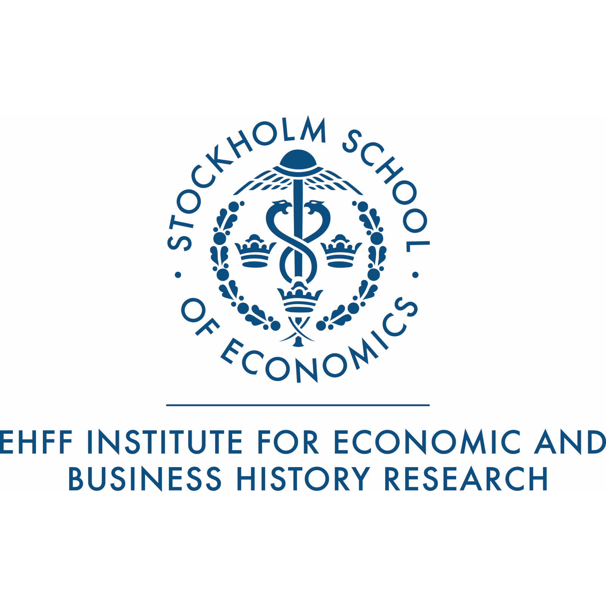
          </a>
          
          <a href="">
            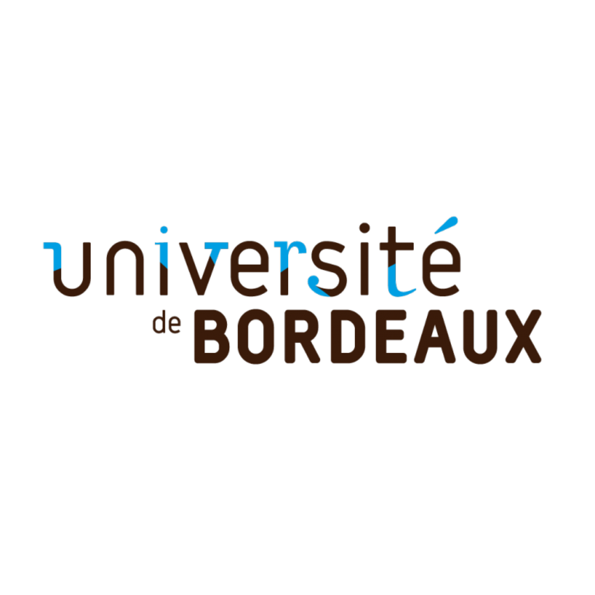
          </a>
    

### Event partner

  

    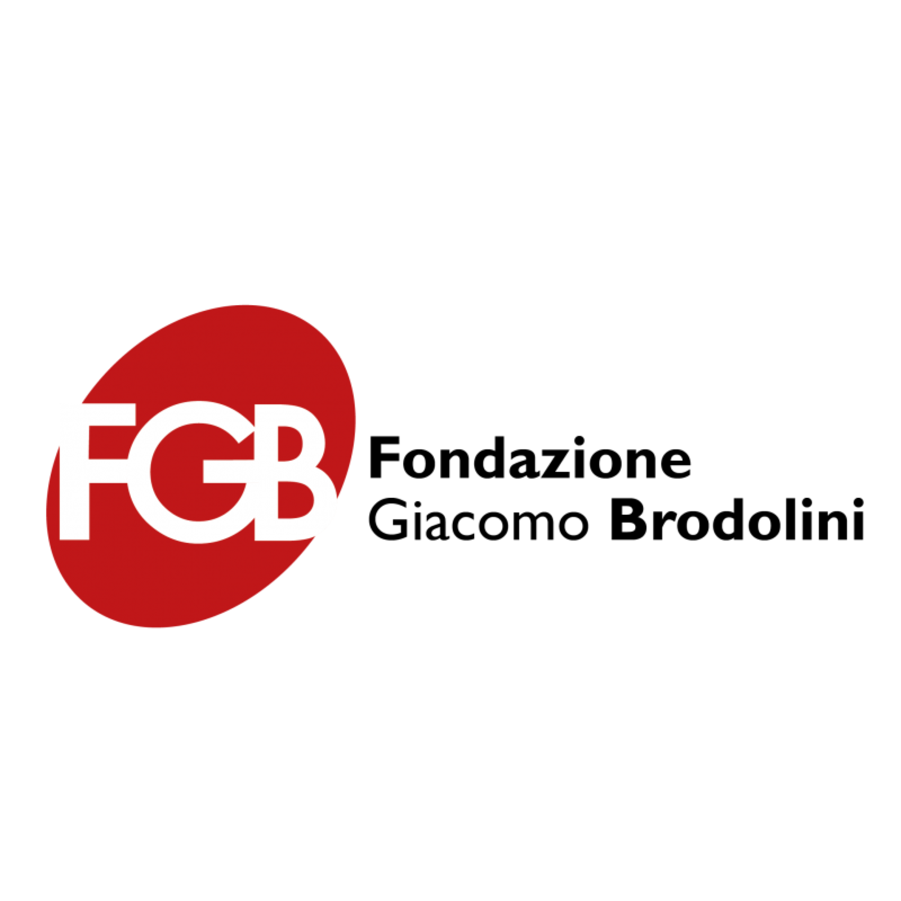
    
  

### Co-Organized with

  

    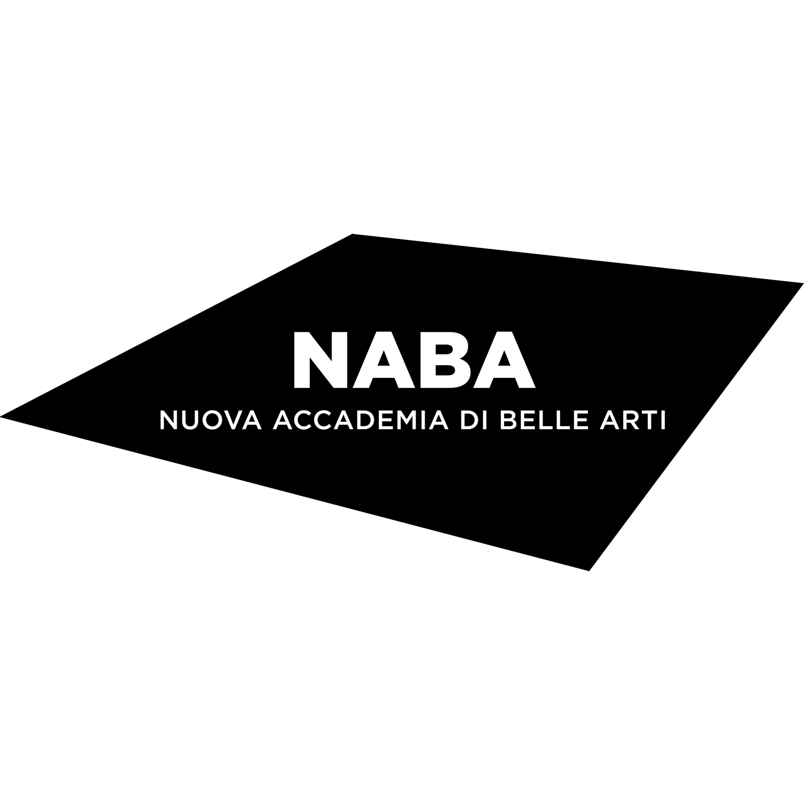
    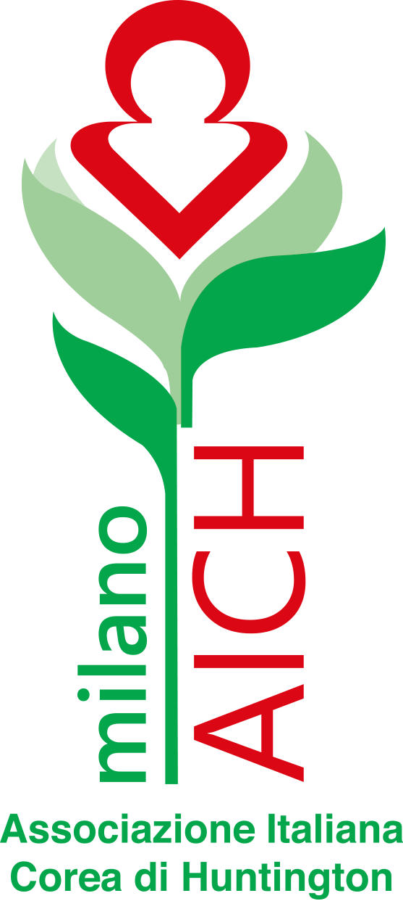
    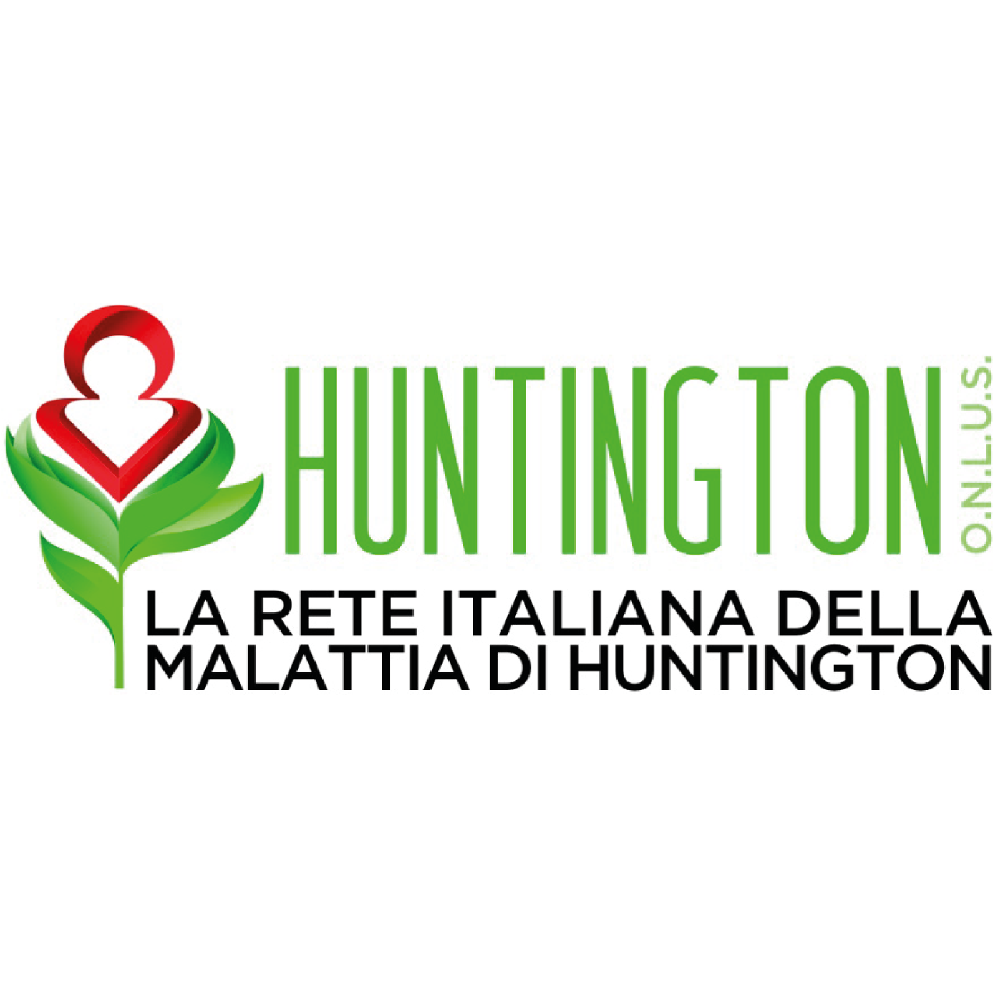
  

### Whit the kind contribution of

  

    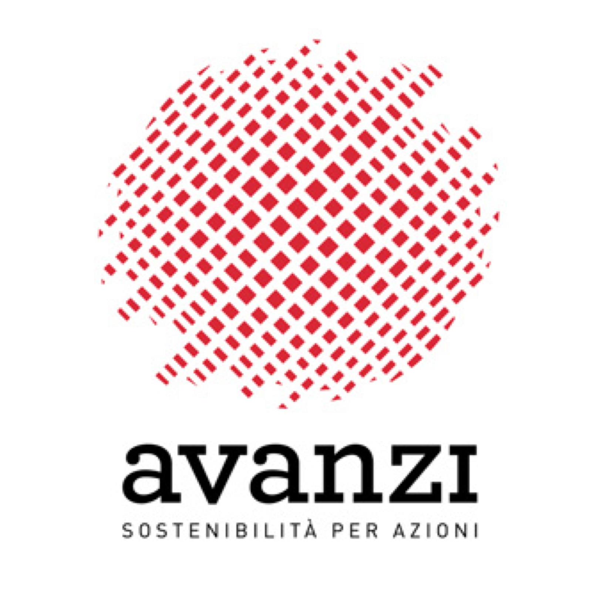
    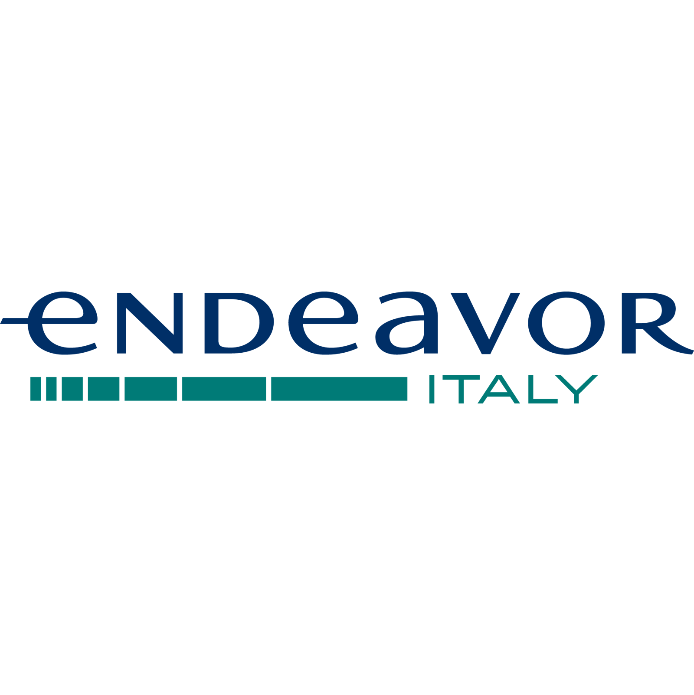
    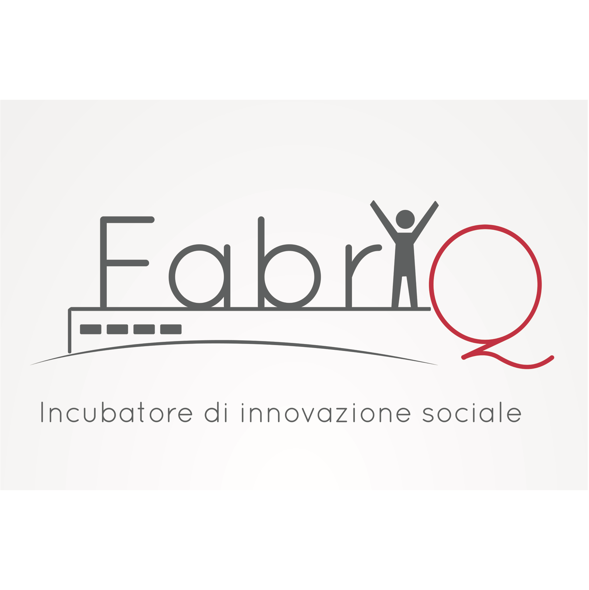
    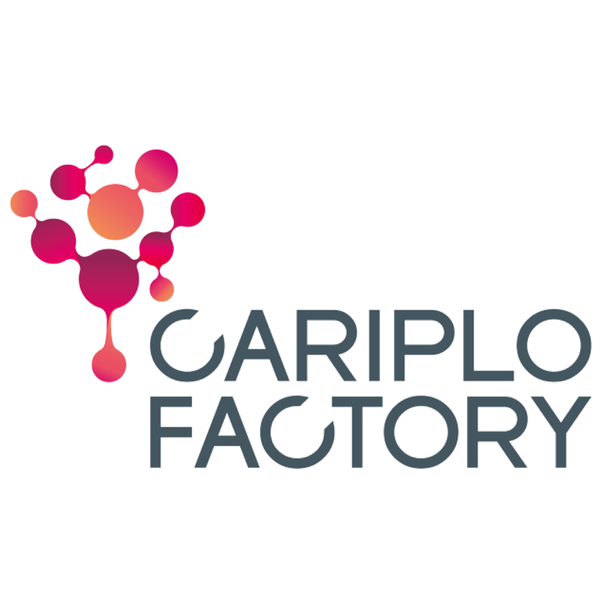
    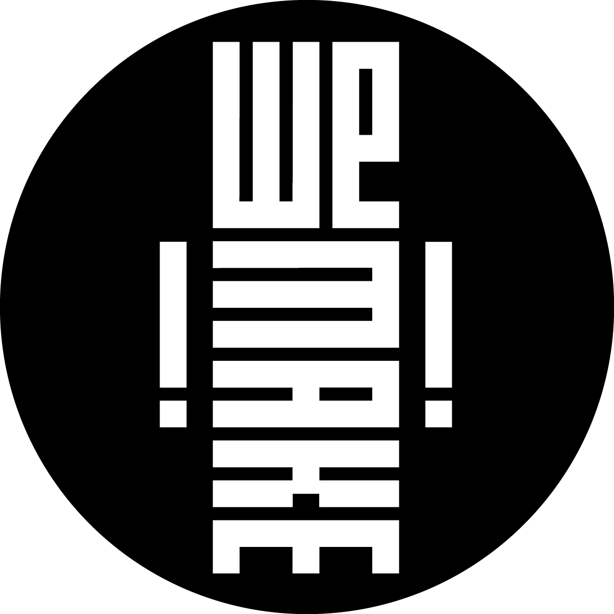
  

<!-- -----
## Program (short version)

### 22nd November - 2:00 pm to 7:00pm
- Next generation internet, digital social innovation & citizen engagement
- The relationship between collective intelligence and social innovation
- Cities as platforms for open innovation and the role of the Public Administration

### 23d November - 10:00am to 5:30pm (followed by refreshments)
- New urban economy and Manufacturing 4.0 as a digital lever for inclusive innovation
- Care as an open and collaborative system
- Care economies and innovation
- Re-thinking care systems for people and with people: some real-life examples

---- -->
